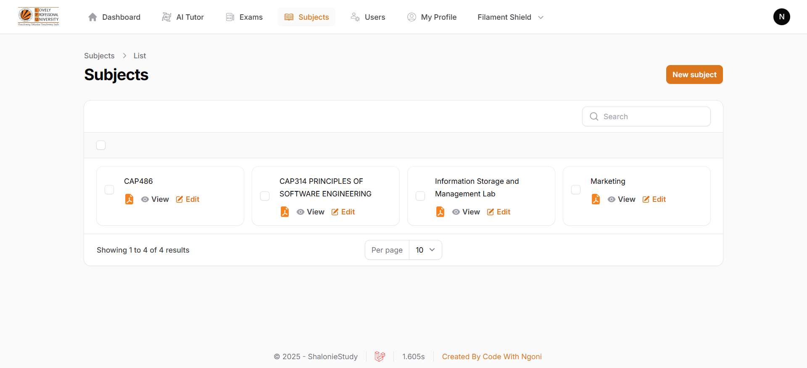

# Features

- Upload syllabus, lecture notes (PDFs, PPTs, books, or teacher-provided materials)
- Automatically extract topics from the uploaded syllabus and store them in the database using [PHP/Parser](https://github.com/smalot/pdfparser)
- Add personal class notes and AI will generate smart summaries
- AI-powered exam generation – More than 20 MCQs with options A-D, based on the uploaded content
-  Practice for CA’s, Midterms, and Final Exams in an engaging way
- Average Marks Analytics
- Roles and Permissions using [Spatie](https://filamentphp.com/plugins/bezhansalleh-shield)
- Activity Logs 

# Images
| | | |
|:-------------------------:|:-------------------------:|:-------------------------:|
|  |  |  |
|  |  |  |


more images check them [here](./images/)


# Requirements to run this project
- Mistral API [click here](https://console.mistral.ai/api-keys/)
- Gemini API [click here](https://aistudio.google.com/app/apikey)

## Platform Features Plan

- [x] User Auth
- [x] Manage Subjects
- [x] Manage Syllabus
- [x] Generate Units and Topics from Syllabus automatically
- [x] Media View
- [x] Manage Notes
- [x] Allow users to select subject, units, topics, exam. Generate MCQs exams using AI, (Input: Subject, units, topics, .)
- [x] Exam interface, Multiple choice loop
- [x] Mark answers, and generate scores
- [ ] Study Session Page, Mark Syllabus, units, topics and notes
- [ ] Generate Flashcard using AI (OpenAI or Geminni) only key points
- [ ] Summarize Notes using AI
- [ ] Use AI to show weak areas (units/topics with poor performance). And Study Recommendations
- [ ] Exams Perfomance, Subject Perfomance, Best Marks Perfomance, Next Date Exam, Topics with weaknesses
- [ ] Send Alerts

## Admin Reg
- [ ] regenerate Policies `php artisan shield:generate --all`
- [ ] reAssign Super Admin `php artisan shield:super-admin`


``` php
using this concept
 <div class="chat-box">
                                <div class="chat-desc customscroll">
                                    <ul id="chat-list">
                                        <!-- Chat messages go here -->
                                        <li class="clearfix AI-response" id="${aiId}">
                                            <span class="chat-img">
                                                
                                            </span>
                                            <div class="chat-body clearfix">
                                                <p class="typing">Hello I am AI here willing to help</p>

                                            </div>
                                        </li>
                                    </ul>

                                </div>
                                <div class="chat-footer">

                                    <div class="file-upload"><a href="#"></a></div>
                                    <div class="chat_text_area">
                                        <textarea id="chat-input" placeholder="Type your message…"></textarea>
                                    </div>
                                    <div class="chat_send">
                                        <button id="send-btn" class="btn btn-link"><i
                                                class="icon-copy ion-paper-airplane"></i></button>
                                    </div>
                                </div>
                            </div>

  <style>
        .chat-body p {
            white-space: pre-wrap;
            /* preserves spacing */
            word-break: break-word;
            /* breaks long strings */
            max-width: 90%;
            overflow-wrap: break-word;
        }

        .typing .dot {
            animation: blink 1.4s infinite;
            display: inline-block;
            margin: 0 2px;
        }

        .typing .dot:nth-child(2) {
            animation-delay: 0.2s;
        }

        .typing .dot:nth-child(3) {
            animation-delay: 0.4s;
        }

        @keyframes blink {

            0%,
            80%,
            100% {
                opacity: 0;
            }

            40% {
                opacity: 1;
            }
        }
    </style>

    <script>
        document.getElementById('send-btn').addEventListener('click', async function() {
            const input = document.getElementById('chat-input');
            const message = input.value.trim();
            if (!message) return;

            const chatList = document.getElementById('chat-list');

            const adminMessage = `
            <li class="clearfix admin_chat">
                <span class="chat-img">
                    
                </span>
                <div class="chat-body clearfix">
                    <p>${message}</p>
                    <div class="chat_time">${new Date().toLocaleTimeString([], { hour: '2-digit', minute: '2-digit' })}</div>
                </div>
            </li>`;
            chatList.insertAdjacentHTML('beforeend', adminMessage);
            input.value = '';

            const aiId = `ai-msg-${Date.now()}`;
            const aiMessage = `
            <li class="clearfix AI-response" id="${aiId}">
                <span class="chat-img">
                    
                </span>
                <div class="chat-body clearfix">
                    <p class="typing"><span class="dot">.</span><span class="dot">.</span><span class="dot">.</span></p>
                    <div class="chat_time">${new Date().toLocaleTimeString([], { hour: '2-digit', minute: '2-digit' })}</div>
                </div>
            </li>`;
            chatList.insertAdjacentHTML('beforeend', aiMessage);
            chatList.scrollTop = chatList.scrollHeight;

            // Disable button while waiting
            document.getElementById('send-btn').disabled = true;

            try {
                const res = await fetch('/chat', {
                    method: 'POST',
                    headers: {
                        'Content-Type': 'application/json',
                        'X-CSRF-TOKEN': document.querySelector('meta[name="csrf-token"]').getAttribute(
                            'content'),
                    },
                    body: JSON.stringify({
                        message
                    }),
                });

                const data = await res.json();
                const fullText = data.reply || 'No response';
                const aiTextElem = document.querySelector(`#${aiId} .typing`);
                aiTextElem.innerHTML = '';

                let i = 0;
                const interval = setInterval(() => {
                    if (i >= fullText.length) {
                        clearInterval(interval);
                        document.getElementById('send-btn').disabled = false;
                        return;
                    }

                    let char = fullText[i];
                    // Escape characters for HTML
                    if (char === '<') char = '&lt;';
                    else if (char === '>') char = '&gt;';
                    else if (char === '&') char = '&amp;';
                    else if (char === '\n') char = '<br>';

                    aiTextElem.innerHTML += char;
                    chatList.scrollTop = chatList.scrollHeight;
                    i++;
                }, 20);

            } catch (err) {
                const aiTextElem = document.querySelector(`#${aiId} .typing`);
                aiTextElem.innerHTML = 'Sorry, something went wrong.';
                document.getElementById('send-btn').disabled = false;
            }
        });
    </script>


   Route::post('/chat', function (Request $request) {
        $userInput = $request->input('message');

        $response = Http::post(
            'https://generativelanguage.googleapis.com/v1beta/models/gemini-2.0-flash:generateContent?key=' . env('GEMINI_API_KEY'),
            [
                'contents' => [
                    ['parts' => [['text' => $userInput]]]
                ]
            ]
        );

        $raw = $response->json();
        $message = $raw['candidates'][0]['content']['parts'][0]['text'] ?? 'No response';

        // Clean and strip asterisks
        $message = html_entity_decode($message);
        $message = str_replace('*', '', $message); // Remove asterisks

        return response()->json(['reply' => $message]);
    });


Peform the same operation here

```